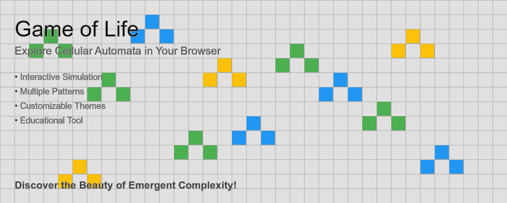

# Game of Life Chrome Extension



[](https://chrome.google.com/webstore/detail/jiaoidmocpfggkklhleleghgkknnjpjh)
[](LICENSE)

## Overview

This Chrome extension brings Conway's Game of Life to your browser, offering an interactive and visually appealing simulation of cellular automata. Explore the fascinating world of emergent complexity, create intricate patterns, and watch as they evolve over time.

A full web version of this application is available at [https://dorpascal.com/game-of-life-ai/](https://dorpascal.com/game-of-life-ai/)

## Features

- **Interactive Grid**: Click to toggle cells on or off, creating your own initial patterns.
- **Simulation Controls**: Start, pause, and step through generations at your own pace.
- **Randomize**: Generate random patterns with a single click for endless exploration.
- **Clear Board**: Wipe the slate clean to start fresh anytime.
- **Customizable Themes**: Personalize your viewing experience with various color schemes.
- **Responsive Design**: Enjoy the Game of Life on various screen sizes.

## Installation

### Chrome Web Store

1. Visit the [Chrome Web Store](https://chrome.google.com/webstore/category/extensions) (link to be updated when published)
2. Search for "Game of Life by Dor Pascal"
3. Click "Add to Chrome"

### Local Installation (for development)

1. Clone this repository:

   ```bash
   git clone https://github.com/Dor-sketch/game-of-life-extension.git
   ```

2. Open Chrome and navigate to `chrome://extensions/`
3. Enable "Developer mode" in the top right corner
4. Click "Load unpacked" and select the cloned repository folder

## Usage

1. Click the extension icon in your Chrome toolbar to open the Game of Life simulator.
2. Use the controls at the bottom to start, pause, clear, or randomize the simulation.
3. Click on individual cells to toggle them on or off.
4. Select different themes from the dropdown menu to customize the appearance.

## How It Works

The Game of Life follows simple rules:

1. Any live cell with two or three live neighbors survives.
2. Any dead cell with three live neighbors becomes a live cell.
3. All other live cells die in the next generation. Similarly, all other dead cells stay dead.

These simple rules lead to complex and fascinating patterns!

## Development

This project is built using HTML, CSS, and JavaScript. The main files are:

- `manifest.json`: Chrome extension configuration
- `popup.html`: The main interface of the extension
- `game.js`: Core Game of Life logic and UI interactions
- `background.js`: Background script for the extension

To contribute:

1. Fork the repository
2. Create your feature branch (`git checkout -b feature/AmazingFeature`)
3. Commit your changes (`git commit -m 'Add some AmazingFeature'`)
4. Push to the branch (`git push origin feature/AmazingFeature`)
5. Open a Pull Request

## Web Version

A full web version of this Game of Life simulation is available at [https://dorpascal.com/game-of-life-ai/](https://dorpascal.com/game-of-life-ai/). This version offers additional features and a larger grid for a more immersive experience.

## License

Distributed under the MIT License. See `LICENSE` for more information.

## Contact

Dor Pascal - [dorpascal.com](https://dorpascal.com), mail: [dor@dorpascal.com](mailto:dor@dorpascal.com)

Project Link: [https://github.com/Dor-sketch/game-of-life-chrome-extension](https://github.com/Dor-sketch/game-of-life-chrome-extension)

## Acknowledgements

- [Conway's Game of Life](https://en.wikipedia.org/wiki/Conway%27s_Game_of_Life)
- [Chrome Extension Documentation](https://developer.chrome.com/docs/extensions/)
- [ImageMagick](https://imagemagick.org/) for icon generation
